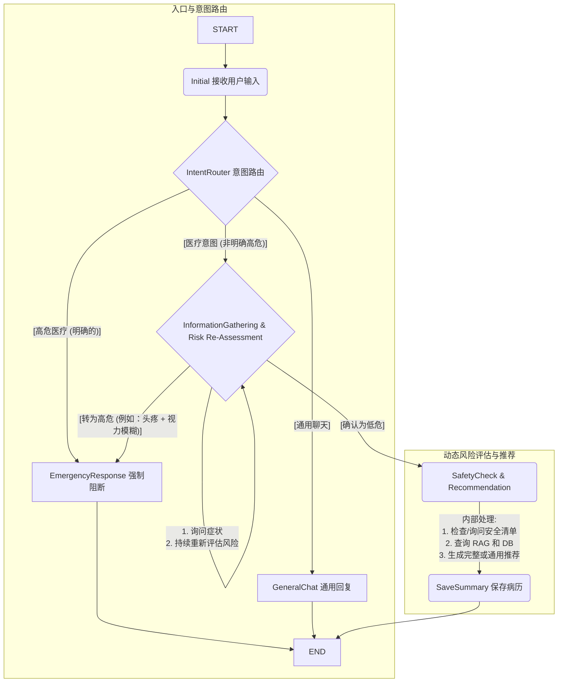

# 医疗咨询状态图使用指南

## 概述

本项目使用 LangGraph4j 实现了一个完整的医疗咨询状态图系统，能够根据用户输入自动进行意图识别、风险评估和动态信息收集。

## 状态图结构



## 核心组件

### 1. 状态类 (MedicalConsultationState)

位置：`src/main/java/com/yihu/agent/graph/state/MedicalConsultationState.java`

包含以下关键字段：
- `userInput`: 当前用户输入
- `intentType`: 意图类型（高危医疗、通用聊天、医疗咨询）
- `riskLevel`: 风险等级（HIGH、MEDIUM、LOW、UNASSESSED）
- `symptoms`: 收集的症状列表
- `conversationHistory`: 对话历史
- `response`: 当前响应内容
- `needMoreInfo`: 是否需要继续收集信息

### 2. 节点类

所有节点位于：`src/main/java/com/yihu/agent/graph/nodes/`

#### InitialNode - 初始节点
- 接收用户输入
- 初始化对话状态
- 记录对话历史

#### IntentRouterNode - 意图路由节点
- 使用 LLM 识别用户意图
- 分类：
  - `EMERGENCY_MEDICAL`: 高危医疗（胸痛、呼吸困难等）
  - `GENERAL_CHAT`: 通用聊天
  - `MEDICAL_INQUIRY`: 一般医疗咨询

#### EmergencyResponseNode - 紧急响应节点
- 处理高危医疗情况
- 提供紧急就医指引
- 强制阻断流程，直接结束

#### GeneralChatNode - 通用聊天节点
- 处理非医疗相关的日常对话
- 提供友好的AI助手回复

#### InformationGatheringNode - 信息收集节点
- 动态收集症状信息
- 持续重新评估风险等级
- 生成针对性问题
- 支持循环收集（最多5轮）

#### SafetyCheckAndRecommendationNode - 安全检查与推荐节点
- 执行安全检查清单
- 生成专业医疗建议
- 包含：症状分析、建议措施、就医建议、注意事项

#### SaveSummaryNode - 保存摘要节点
- 生成完整的病历摘要
- 记录咨询过程
- 保存到日志（可扩展至数据库）

### 3. 状态图配置 (MedicalConsultationGraph)

位置：`src/main/java/com/yihu/agent/graph/MedicalConsultationGraph.java`

负责：
- 定义所有节点
- 配置节点间的边和条件边
- 实现状态流转逻辑

### 4. 服务类 (MedicalConsultationService)

位置：`src/main/java/com/yihu/agent/service/MedicalConsultationService.java`

提供：
- `processConsultation(userId, userInput)`: 处理单次咨询
- `processWithState(state, userInput)`: 处理多轮对话
- `createNewSession(userId)`: 创建新会话

### 5. 控制器 (MedicalConsultationController)

位置：`src/main/java/com/yihu/agent/controller/MedicalConsultationController.java`

REST API端点：
- `POST /api/consultation/ask`: 提交咨询请求
- `GET /api/consultation/health`: 健康检查

## 使用方法

### 1. 启动应用

```bash
mvn spring-boot:run
```

或使用提供的批处理文件：
```bash
start-chat.bat
```

### 2. 发送咨询请求

#### 使用 cURL

```bash
curl -X POST http://localhost:8080/api/consultation/ask \
  -H "Content-Type: application/json" \
  -d '{
    "userId": "user123",
    "message": "我最近总是头疼"
  }'
```

#### 使用 JavaScript

```javascript
fetch('http://localhost:8080/api/consultation/ask', {
  method: 'POST',
  headers: {
    'Content-Type': 'application/json',
  },
  body: JSON.stringify({
    userId: 'user123',
    message: '我最近总是头疼'
  })
})
.then(response => response.json())
.then(data => console.log(data.response));
```

### 3. 测试场景

#### 场景1：高危医疗情况
```json
{
  "userId": "user001",
  "message": "我突然感到剧烈胸痛，无法呼吸"
}
```
**预期结果**：立即触发紧急响应，提供急救指引

#### 场景2：一般医疗咨询
```json
{
  "userId": "user002",
  "message": "我最近总是失眠"
}
```
**预期结果**：进入信息收集流程，询问相关症状

#### 场景3：通用聊天
```json
{
  "userId": "user003",
  "message": "今天天气真好"
}
```
**预期结果**：友好的日常对话回复

## 配置说明

### application.yml 配置

```yaml
langchain4j:
  open-ai:
    chat-model:
      # API密钥
      api-key: ${AI_API_KEY:your-api-key}
      
      # API基础URL
      # OpenAI: https://api.openai.com/v1
      # DeepSeek: https://api.deepseek.com
      # 阿里云: https://dashscope.aliyuncs.com/compatible-mode/v1
      base-url: ${AI_BASE_URL:https://api.openai.com/v1}
      
      # 模型名称
      model-name: ${AI_MODEL_NAME:gpt-3.5-turbo}
      
      # 温度参数（0.0-2.0）
      temperature: 0.7
      
      # 最大token数
      max-tokens: 2000
```

### 环境变量

可以通过环境变量覆盖配置：

```bash
export AI_API_KEY=your-api-key
export AI_BASE_URL=https://api.openai.com/v1
export AI_MODEL_NAME=gpt-3.5-turbo
```

## 扩展功能

### 1. 数据库集成

在 `SaveSummaryNode` 中添加数据库保存逻辑：

```java
// 注入数据库服务
@Autowired
private MedicalRecordRepository repository;

// 在process方法中
MedicalRecord record = new MedicalRecord();
record.setUserId(state.getUserId());
record.setSummary(summary);
repository.save(record);
```

### 2. RAG集成

在 `SafetyCheckAndRecommendationNode` 中集成RAG：

```java
// 注入RAG服务
@Autowired
private RAGService ragService;

// 查询相关医疗知识
String relevantInfo = ragService.query(state.getSymptoms());
```

### 3. 多轮对话支持

通过WebSocket实现：

```java
@MessageMapping("/consultation/chat")
public void handleMultiRound(MedicalConsultationState state, String input) {
    consultationService.processWithState(state, input)
        .thenAccept(result -> {
            // 发送响应
            messagingTemplate.convertAndSend(
                "/topic/response/" + state.getUserId(), 
                result.getResponse()
            );
        });
}
```

## 日志查看

应用运行时会输出详细的日志信息：

```
INFO  - InitialNode: 接收用户输入 - 我最近总是头疼
INFO  - IntentRouterNode: 识别意图为 - MEDICAL_INQUIRY
INFO  - InformationGatheringNode: 开始信息收集与风险评估
INFO  - InformationGatheringNode: 当前风险等级 - LOW, 需要更多信息 - true
...
```

## 故障排查

### 1. ChatLanguageModel Bean未找到

确保配置了正确的API密钥和基础URL，检查 `application.yml`

### 2. 状态图初始化失败

检查日志中的错误信息，确认所有依赖已正确注入

### 3. LLM响应超时

增加超时时间配置：
```yaml
langchain4j:
  open-ai:
    chat-model:
      timeout: 120
```

## 性能优化

1. **缓存LLM响应**：对于相同或相似的输入，缓存响应结果
2. **异步处理**：使用CompletableFuture进行异步处理
3. **批量处理**：合并多个LLM调用减少网络开销
4. **流式响应**：对于长文本响应使用流式输出

## 安全考虑

1. **输入验证**：验证用户输入，防止注入攻击
2. **速率限制**：限制每个用户的请求频率
3. **敏感信息**：不记录用户的敏感医疗信息
4. **免责声明**：在所有医疗建议中包含免责声明

## 下一步计划

- [ ] 集成向量数据库实现RAG
- [ ] 添加语音输入支持
- [ ] 实现会话持久化
- [ ] 添加多语言支持
- [ ] 优化LLM Prompt提高准确性
- [ ] 添加用户反馈机制
- [ ] 实现A/B测试框架

