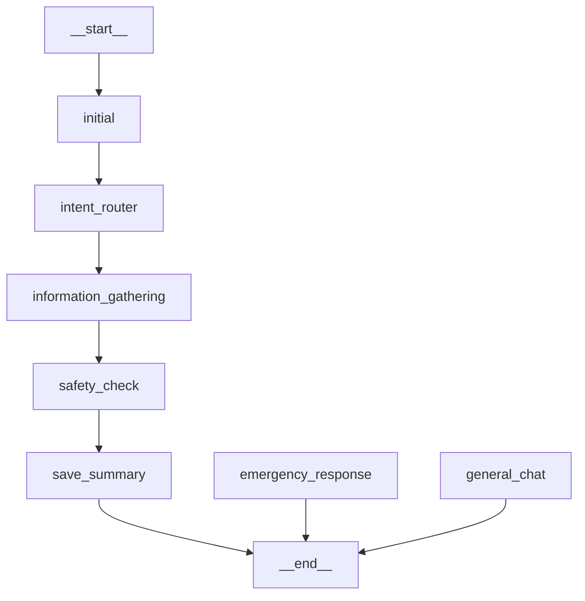
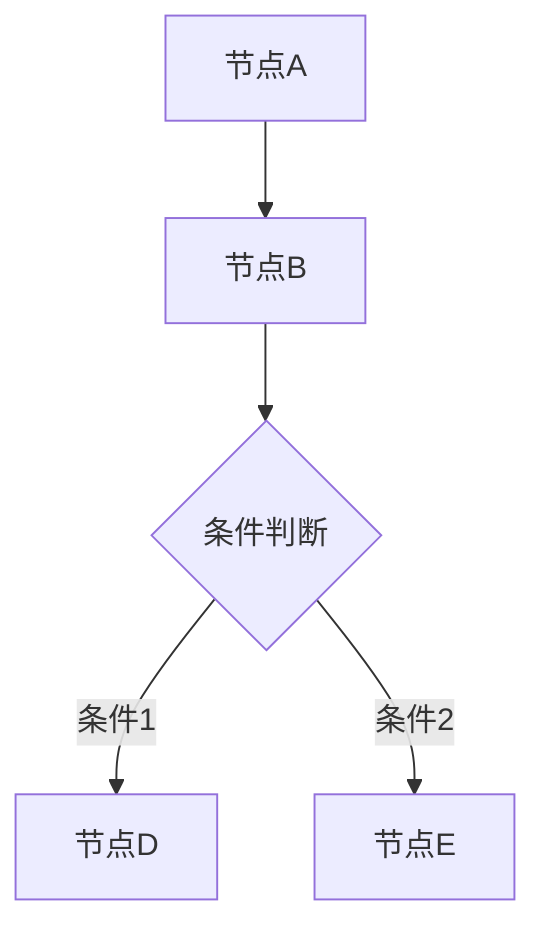
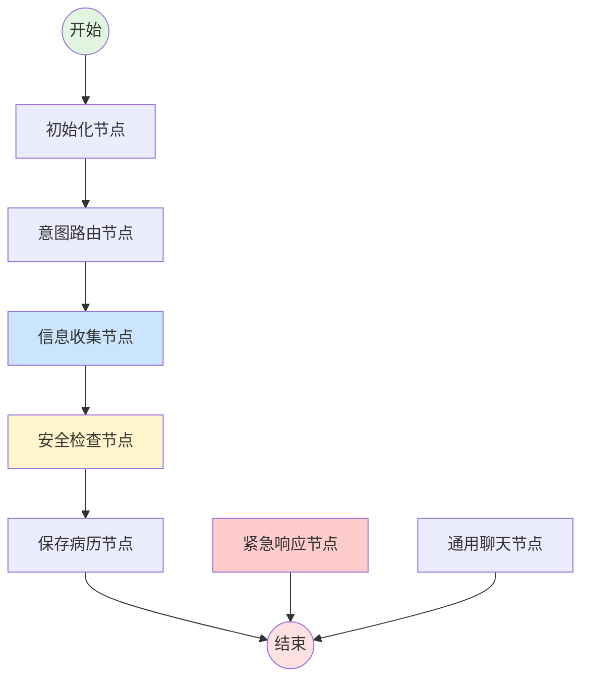

# 🎨 查看医疗咨询状态图指南

## 📍 查看位置

你可以通过 **3 种方式** 查看构建的状态图：

### 方式 1: 启动时自动打印 ✅ **最方便**

当你启动 Spring Boot 应用时，状态图会自动打印到控制台。

**查看步骤：**
1. 启动应用
   ```bash
   mvn spring-boot:run
   ```

2. 在控制台日志中查找以下内容：
   ```
   ========================================
   医疗咨询状态图 (Mermaid 格式)
   ========================================
   graph TD
       __start__ --> initial
       initial --> intent_router
       ...
   ========================================
   在线预览: https://mermaid.live/
   将以上 Mermaid 代码复制到在线编辑器即可查看图形
   ========================================
   ```

3. 复制 `graph TD` 到 `END` 之间的所有内容

4. 访问 https://mermaid.live/ 并粘贴内容即可查看可视化图形

### 方式 2: 通过 API 获取（JSON 格式）

**API 端点：**
```
GET http://localhost:8080/api/consultation/graph
```

**使用 curl：**
```bash
curl http://localhost:8080/api/consultation/graph
```

**响应示例：**
```json
{
  "mermaid": "graph TD\n    __start__ --> initial\n    ...",
  "previewUrl": "https://mermaid.live/",
  "description": "复制 mermaid 字段的内容到在线编辑器即可查看图形"
}
```

**浏览器访问：**
```
http://localhost:8080/api/consultation/graph
```

### 方式 3: 通过 API 获取（纯文本格式）✅ **最适合复制**

**API 端点：**
```
GET http://localhost:8080/api/consultation/graph/raw
```

**使用 curl：**
```bash
curl http://localhost:8080/api/consultation/graph/raw
```

**浏览器访问：**
```
http://localhost:8080/api/consultation/graph/raw
```

这个端点直接返回纯 Mermaid 文本，方便复制。

## 🎨 可视化状态图

### 在线工具

将获取到的 Mermaid 代码粘贴到以下任一在线编辑器：

1. **Mermaid Live Editor** （推荐）
   - 网址: https://mermaid.live/
   - 特点: 官方编辑器，功能最全
   - 可以实时预览、导出图片、分享链接

2. **Mermaid Chart**
   - 网址: https://www.mermaidchart.com/
   - 特点: 更专业的图表工具
   - 支持团队协作

3. **GitHub/GitLab**
   - 在 Markdown 文件中直接使用
   ```markdown
   \```mermaid
   graph TD
       __start__ --> initial
       ...
   \```
   ```

### IDE 插件

**VS Code:**
```
安装插件: Markdown Preview Mermaid Support
```

**IntelliJ IDEA:**
```
安装插件: Mermaid
```

**Markdown 文件中使用:**
````markdown

````

## 📊 当前状态图结构

### 简化流程（当前实现）

```
START
  ↓
Initial (初始化)
  ↓
IntentRouter (意图路由)
  ↓
InformationGathering (信息收集)
  ↓
SafetyCheck (安全检查)
  ↓
SaveSummary (保存病历)
  ↓
END
```

### 完整流程（计划中）

```
START
  ↓
Initial (初始化)
  ↓
IntentRouter (意图路由)
  ├─[高危]→ EmergencyResponse → END
  ├─[聊天]→ GeneralChat → END
  └─[医疗]→ InformationGathering
              ├─[风险升级]→ EmergencyResponse → END
              ├─[需要更多信息]→ InformationGathering (循环)
              └─[信息充足]→ SafetyCheck → SaveSummary → END
```

## 🔍 Mermaid 代码说明

### 基本语法



### 节点类型

- `[方框]` - 普通节点
- `{菱形}` - 条件判断节点
- `((圆形))` - 起始/结束节点
- `>异形]` - 特殊节点

### 边的类型

- `-->` - 实线箭头
- `-.->` - 虚线箭头
- `==>` - 粗线箭头
- `-->|标签|` - 带标签的箭头

## 📝 示例输出

### 实际的 Mermaid 代码示例



## 🛠️ 常见问题

### Q1: 启动时没有看到状态图？

**检查项：**
1. 确认日志级别为 DEBUG 或 INFO
2. 查看完整的启动日志
3. 检查是否有错误导致启动失败

**查看日志配置：**
```yaml
# application.yml
logging:
  level:
    com.yihu.agent: DEBUG
```

### Q2: API 返回错误？

**检查项：**
1. 确认应用已成功启动
2. 确认端口 8080 没有被占用
3. 检查健康检查端点：
   ```bash
   curl http://localhost:8080/api/consultation/health
   ```

### Q3: Mermaid 代码无法渲染？

**可能原因：**
1. 复制的代码不完整
2. 在线编辑器版本问题
3. 语法错误

**解决方法：**
1. 确保复制了完整的代码（从 `graph TD` 到最后）
2. 尝试不同的在线编辑器
3. 检查是否有特殊字符

### Q4: 想要导出为图片？

**在 Mermaid Live Editor 中：**
1. 粘贴代码并渲染
2. 点击右上角的 "Actions" 按钮
3. 选择 "Download PNG" 或 "Download SVG"

## 🎯 快速测试

**一键获取并查看状态图：**

```bash
# 1. 启动应用
mvn spring-boot:run

# 2. 获取状态图（新终端）
curl http://localhost:8080/api/consultation/graph/raw > graph.txt

# 3. 打开 graph.txt 并复制内容到 https://mermaid.live/
```

**PowerShell 版本：**
```powershell
# 获取并打开
Invoke-WebRequest -Uri "http://localhost:8080/api/consultation/graph/raw" -OutFile "graph.txt"
notepad graph.txt
```

## 📚 相关资源

- **Mermaid 官方文档**: https://mermaid.js.org/
- **Mermaid Live Editor**: https://mermaid.live/
- **Mermaid 语法教程**: https://mermaid.js.org/intro/syntax-reference.html
- **LangGraph4j 文档**: https://langgraph4j.github.io/langgraph4j/

## 💡 提示

1. **启动时查看最直接**：应用启动时会自动打印，无需额外操作
2. **API 方式更灵活**：可以随时获取，适合集成到其他工具
3. **在线编辑器支持导出**：可以导出为 PNG、SVG、PDF 等格式
4. **可以添加到文档**：将 Mermaid 代码添加到 README.md 或其他文档中

---

**更新时间**: 2025-11-05  
**相关文件**: 
- `src/main/java/com/yihu/agent/service/MedicalConsultationService.java`
- `src/main/java/com/yihu/agent/controller/MedicalConsultationController.java`


