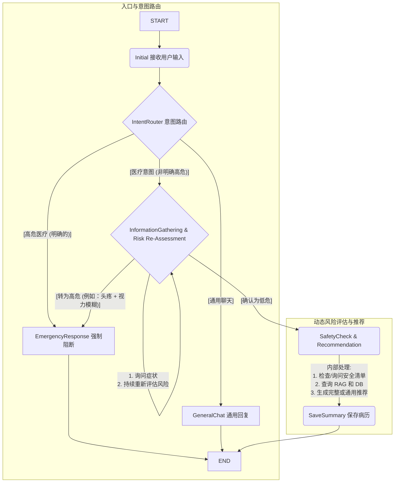

```mermaid
graph TD

subgraph "入口与意图路由"

A[START] --> B(Initial 接收用户输入);

B --> C{IntentRouter 意图路由};

C -- "[高危医疗 (明确的)]" --> D[EmergencyResponse 强制阻断];

D --> Z[END];

C -- "[通用聊天]" --> E[GeneralChat 通用回复];

E --> Z[END];

C -- "[医疗意图 (非明确高危)]" --> G{InformationGathering & Risk Re-Assessment};

end


subgraph "动态风险评估与推荐"

G -- "1. 询问症状<br>2. 持续重新评估风险" --> G;

G -- "[转为高危 (例如：头疼 + 视力模糊)]" --> D;

G -- "[确认为低危]" --> M(SafetyCheck & Recommendation);

M -- "内部处理:<br>1. 检查/询问安全清单<br>2. 查询 RAG 和 DB<br>3. 生成完整或通用推荐" --> N(SaveSummary 保存病历);

N(SaveSummary 保存病历) --> Z[END];

end
```