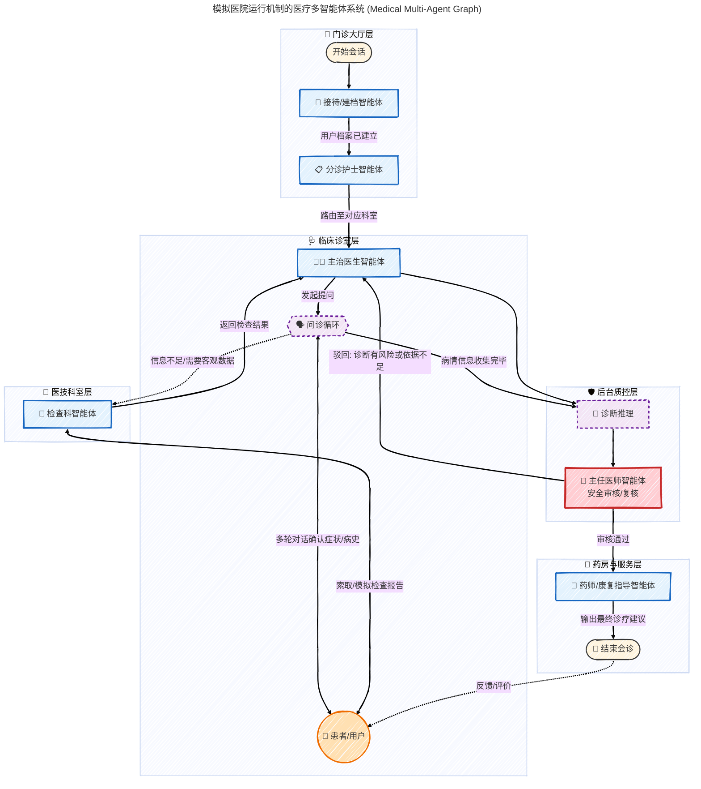

这是一个非常好的构想！将医疗 AI 设计成模拟真实医院运行机制的多智能体系统（Multi-Agent System），不仅能让流程更清晰，还能通过不同角色的专精分工来提高诊断的准确性和系统的可解释性。

### 🏥 模拟医院机制的医疗多智能体设计思路

为了模拟医院的真实运行机制，我们需要拆分出几个核心的“职能角色”（智能体）：

1.  **导诊/分诊台 (Reception/Triage Agent)**: 负责初步接待，询问最基本的症状（主诉），判断挂什么科，并引导用户进入下一个环节。
2.  **主治医生 (Attending Physician Agent)**: 核心智能体。负责详细问诊（现病史、既往史等），并在必要时开具“检查单”。
3.  **医技/检查科 (Medical Technologist Agent)**: 如果医生觉得信息不足，需要用户提供更多数据（如“请问您最近有测量过体温吗？是多少度？”或者模拟“建议您去做一个血常规”），由这个智能体负责收集特定的客观数据。
4.  **主任医师/质控 (Chief Physician/Supervisor Agent)**: 这是医疗场景中非常重要的**安全守门员**。在主治医生给出最终诊断前，由另一个采用不同提示词或模型的智能体进行复核，确保建议安全、合规，避免明显的医疗错误。
5.  **药师/健康顾问 (Pharmacist/Care Agent)**: 在诊断完成后，给出用药指导、生活建议或康复指南。

-----

### 📊 医疗多智能体协作 Mermaid 图

下面是这个系统的架构图。它展示了用户（患者）如何与这些智能体交互，以及智能体之间的数据流转。

### 📝 核心节点与机制解析

这个 Graph 的设计不仅仅是线性的，它包含几个关键的机制：

1.  **🗣️ 问诊循环 (The Interview Loop)**:

    * 这是最核心的部分。真实的医生不会只问一个问题就下结论。`主治医生智能体` 需要维护一个“信息槽（Slot Filling）”，比如必须问清楚症状的 *时间、位置、程度、伴随症状*。
    * 如果信息不全，它会持续在 `Interview` 节点和用户之间循环，直到置信度达到阈值。

2.  **🔬 检查科的介入 (The Lab Sub-routine)**:

    * 在 AI 场景中，这可以模拟为“请求特定结构化数据”。例如，当用户说“发烧”时，医生可能会调用 `检查科智能体`，专门去问“请量一下现在的具体体温是多少摄氏度？”。
    * 这把“开放式对话”暂时切换为“结构化数据收集”模式。

3.  **🛡️ 主任医师复核 (Supervisor / Critic Agent)**:

    * **至关重要！** 医疗 AI 必须有“守门员”。
    * 这个智能体的 Prompt 设计重点不在于“治病”，而在于“找茬”。它会检查主治医生的结论是否过于激进、是否漏掉了危急重症的可能性（如把心梗当胃痛）。如果它觉得有风险，会将流程打回给主治医生重新评估。

4.  **💊 药师/康复指导 (Pharmacist)**:

    * 将诊断（Diagnosis）和建议（Plan）分离。医生负责找出病因，药师负责用通俗易懂的语言解释如何护理、用药注意事项，模拟医院最后的取药窗口叮嘱。

### 🚀 下一步建议

如果你打算用 LangGraph 或类似框架实现这个多智能体系统，建议从简到繁：

1.  **V1 版本**: 只需要 `分诊` -\> `全科医生` -\> `输出建议`。跑通基本的对话状态管理。
2.  **V2 版本**: 加入 `问诊循环`，确保医生能追问。
3.  **V3 版本**: 加入 `主任医师复核`，这对于提升 Demo 的专业度非常有帮助。

你想先深入探讨其中某一个具体角色的 Prompt 设计或者状态管理机制吗？