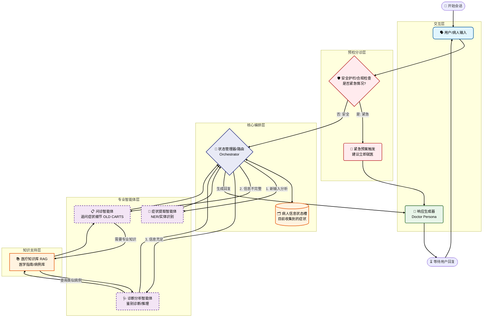

```mermaid
graph TD
    %% 定义样式
    classDef user fill:#e1f5fe,stroke:#01579b,stroke-width:2px,rx:10px,ry:10px,color:#000;
    classDef guard fill:#ffebee,stroke:#b71c1c,stroke-width:2px,rx:5px,ry:5px,color:#000;
    classDef orchestrator fill:#e8eaf6,stroke:#1a237e,stroke-width:2px,rx:5px,ry:5px,color:#000;
    classDef agent fill:#f3e5f5,stroke:#4a148c,stroke-width:2px,rx:5px,ry:5px,stroke-dasharray: 5 5,color:#000;
    classDef rag fill:#fff3e0,stroke:#e65100,stroke-width:2px,rx:0px,ry:0px,color:#000;
    classDef output fill:#e8f5e9,stroke:#1b5e20,stroke-width:2px,rx:5px,ry:5px,color:#000;

    %% 开始节点
    Start([🚀 开始会话]) --> UserInput

    %% 用户输入层
    subgraph Interface [交互层]
        UserInput[🗣️ 用户/病人输入]:::user
        ResponseGen[💬 响应生成器<br>Doctor Persona]:::output
    end

    UserInput --> SafetyGuard

    %% 安全与分诊层
    subgraph Triage [预检分诊层]
        SafetyGuard{🛡️ 安全护栏/合规检查<br>是否紧急情况?}:::guard
        Emergency[🚨 紧急预案触发<br>建议立即就医]:::guard
    end

    SafetyGuard -- 是: 紧急 --> Emergency
    SafetyGuard -- 否: 安全 --> StateManager

    %% 核心编排层
    subgraph Core [核心编排层]
        StateManager{🧠 状态管理器/路由<br>Orchestrator}:::orchestrator
        PatientState[(🗂️ 病人信息状态槽<br>目前收集到的症状)]:::rag
    end

    StateManager <--> PatientState

    %% 智能体工作层
    subgraph Agents [专业智能体层]
        NLU_Agent[🧩 症状提取智能体<br>NER/实体识别]:::agent
        History_Agent[📋 问诊智能体<br>追问症状细节 OLD CARTS]:::agent
        Diagnostic_Agent[🩺 诊断分析智能体<br>鉴别诊断/推理]:::agent
    end
    
    %% 知识库层
    subgraph Knowledge [知识支持层]
        MedicalKB[📚 医疗知识库 RAG<br>医学指南/病例库]:::rag
    end

    %% 路由逻辑
    StateManager -- 1. 新输入分析 --> NLU_Agent
    NLU_Agent --> StateManager
    
    StateManager -- 2. 信息不完整 --> History_Agent
    History_Agent -- 需要专业知识 --> MedicalKB
    MedicalKB --> History_Agent
    History_Agent --> StateManager

    StateManager -- 3. 信息充足 --> Diagnostic_Agent
    Diagnostic_Agent -- 查询类似病例 --> MedicalKB
    MedicalKB --> Diagnostic_Agent
    Diagnostic_Agent --> StateManager

    %% 输出逻辑
    StateManager -- 生成回复 --> ResponseGen
    Emergency --> ResponseGen
    ResponseGen --> UserWait([⏳ 等待用户回复])
    UserWait --> UserInput

    %% 连接注释
    linkStyle default stroke-width:2px,fill:none,stroke:black;

```